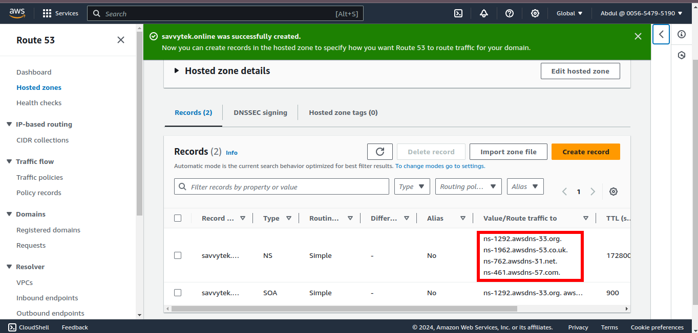
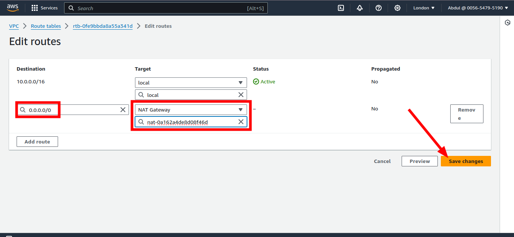
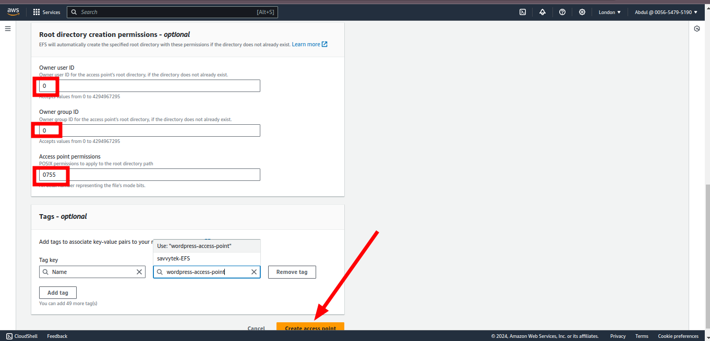
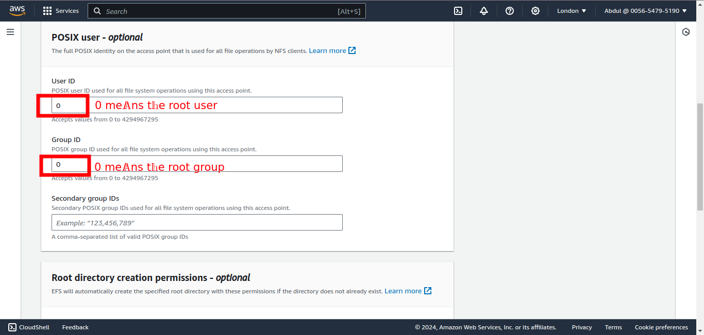
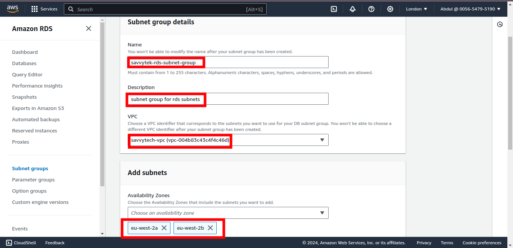
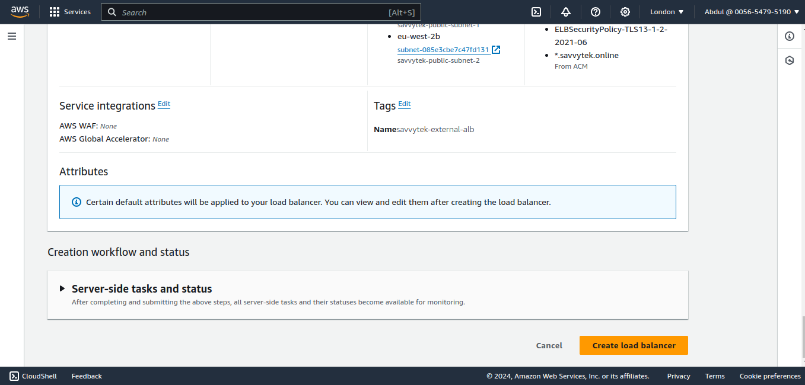
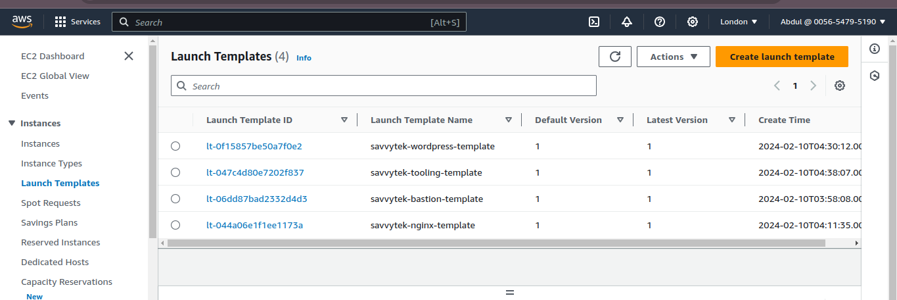
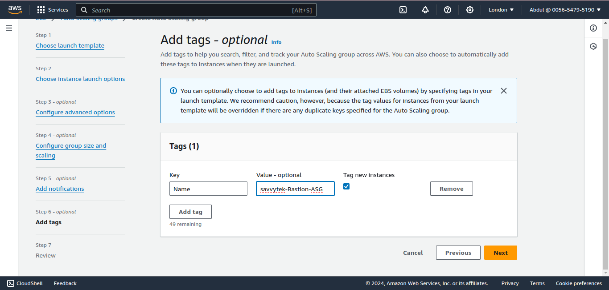
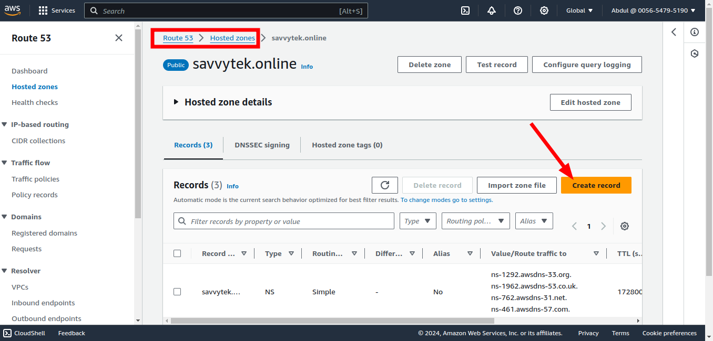

### AWS-CLOUD-SOLUTION-FOR-2-COMPANY-WEBSITES-USING-A-REVERSE-PROXY-TECHNOLOGY
------
#### General Overview
You will build a secure infrastructure inside AWS VPC (Virtual Private Cloud) for a fictitious company named WakaBetter that uses WordPress CMS for its main business website, and a Tooling Website for their DevOps team. As part of the company’s desire for improved security and performance, a decision has been made to use a reverse proxy technology from NGINX to achieve this. Cost, Security, and Scalability are the major requirements for this project. Hence, implementing the architecture designed below, ensure that infrastructure for both websites, WordPress and Tooling, is resilient to Web Server’s failures, can accomodate to increased traffic and, at the same time, has reasonable cost. 

### Requirements
There are few requirements that must be met before you begin:

1. Properly configure your AWS account and Organization Unit Watch How To Do This Here
    * Create an AWS Master account. (Also known as Root Account)
    * Within the Root account, create a sub-account and name it DevOps. (You will need another email address to complete this) 

    

    

    

    

    * Within the Root account, create an AWS Organization Unit (OU). Name it Dev. (We will launch Dev resources in there).

    

    

    * Move the DevOps account into the Dev OU. 
    

    

    

    * Login to the newly created AWS account using the new email address.

    

2. Create a domain name for your company. I used [namecheap](https://www.namecheap.com/).
3. Create a hosted zone in AWS, and map it to your domain. 

 

 

 

 

 

 ### SET UP A VIRTUAL PRIVATE CLOUD (VPC)
 --------
1. Create a VPC

 

 

2. Enable DNS hosting

 

 3. Create internet gateway as shown in the architecture.

 

 

 

 

 

4. Create the subnets as shown in the Architecture

Use this website to get the CIDR blocks easily. [ipinfo](https://ipinfo.io/ips).

5. Create a route table and associate it with public subnets

6. Create a route table and associate it with private subnets

7. Edit a route in public route table, and associate it with the Internet Gateway. (This is what allows a public subnet to be accessible from the Internet).

 

 

 8. Create 3 Elastic IPs
 

 

 9. Create a Nat Gateway and assign one of the Elastic IPs (*The other 2 will be used by Bastion hosts).

10. Create a Security Group for:
    * External Application Load Balancer: External ALB will be accessible from the Internet

    

    

    * Bastion Servers: Access to the Bastion servers should be allowed only from workstations that need to SSH into the bastion servers. Hence, you can use your workstation public IP address.

    

    * Nginx Reverse Proxy Servers: Access to Nginx should only be allowed from a Application Load balancer (ALB).

    

    

    * Internal Application Load Balancer: ALB will be available from the Nginx servers

    

    * Webservers: Access to Webservers should only be allowed from the Internal Application Load Balancer. 

    

    * Data Layer: Access to the Data layer, which is comprised of Amazon Relational Database Service (RDS) and Amazon Elastic File System (EFS) must be carefully designed – only webservers should be able to connect to RDS, while Nginx and Webservers will have access to EFS Mountpoint.

    

### TLS Certificates From Amazon Certificate Manager (ACM)

You will need TLS certificates to handle secured connectivity to your Application Load Balancers (ALB).

* Navigate to AWS ACM

Configure EFS
---
* Create a new EFS File system. Create an EFS mount target per AZ in the VPC, associate it with both subnets dedicated for data layer. Associate the Security groups created earlier for data layer.

* Create 2 access points - ! for each of the website (wordpress and tooling) so that the files do not overwrite each other when we mount. 

### Configure RDS
-----
#### Pre-requisite:

* Create a KMS Key

To ensure that yout databases are highly available and also have failover support in case one availability zone fails, we will configure a multi-AZ set up of RDS MySQL database instance. In our case, since we are only using 2 AZs, we can only failover to one, but the same concept applies to 3 Availability Zones.

To configure RDS, follow steps below:

1. Create a subnet group and add 2 private subnets (data Layer)

2. Create the DataBase

Now create the DB

### Set Up Compute Resources for Bastion
-----
#### Provision the EC2 Instances for Bastion
Create an EC2 Instance based on Red Hat Enterprise Linux (AMI) (You can search for this ami, RHEL-8.7.0_HVM-20230215-x86_64-13-Hourly2-GP2
) per each Availability Zone in the same Region and same AZ where you created Nginx server
* Ensure that it has the following software installed
   * python
   * ntp
   * net-tools
   * vim
   * wget
   * telnet
   * epel-release
   * htop

We will use instance to create an ami for launching instances in Auto-scaling groups so all the installations will be done before creating the ami from the instance

### Bastion ami installation

    sudu su -
    yum install -y https://dl.fedoraproject.org/pub/epel/epel-release-latest-8.noarch.rpm 
    yum install -y dnf-utils http://rpms.remirepo.net/enterprise/remi-release-8.rpm 
    yum install wget vim python3 telnet htop git mysql net-tools chrony -y 
    systemctl start chronyd 
    systemctl enable chronyd

#### Nginx ami installation

    yum install -y https://dl.fedoraproject.org/pub/epel/epel-release-latest-8.noarch.rpm

    yum install -y dnf-utils http://rpms.remirepo.net/enterprise/remi-release-8.rpm

    yum install wget vim python3 telnet htop git mysql net-tools chrony -y

    systemctl start chronyd

    systemctl enable chronyd

### configure selinux policies for the webservers and nginx servers

    setsebool -P httpd_can_network_connect=1
    setsebool -P httpd_can_network_connect_db=1
    setsebool -P httpd_execmem=1
    setsebool -P httpd_use_nfs 1

### This section will insatll amazon efs utils for mounting the target on the Elastic file system

    git clone https://github.com/aws/efs-utils

    cd efs-utils

    yum install -y make

    yum install -y rpm-build

    make rpm 

    yum install -y  ./build/amazon-efs-utils*rpm

### Setting up self-signed certificate for the nginx instance

    sudo mkdir /etc/ssl/private

    sudo chmod 700 /etc/ssl/private

    openssl req -x509 -nodes -days 365 -newkey rsa:2048 -keyout /etc/ssl/private/ACS.key -out /etc/ssl/certs/ACS.crt

    sudo openssl dhparam -out /etc/ssl/certs/dhparam.pem 2048
 When you are done with setting up the self-signed certificate, you should see have s screen like the one below.

 

 * Verify self-signed cert is correctly installed

 

### webserver ami installation

    yum install -y https://dl.fedoraproject.org/pub/epel/epel-release-latest-8.noarch.rpm

    yum install -y dnf-utils http://rpms.remirepo.net/enterprise/remi-release-8.rpm

    yum install wget vim python3 telnet htop git mysql net-tools chrony -y

    systemctl start chronyd

    systemctl enable chronyd

### Configure selinux policies for the webservers and nginx servers

    setsebool -P httpd_can_network_connect=1
    setsebool -P httpd_can_network_connect_db=1
    setsebool -P httpd_execmem=1
    setsebool -P httpd_use_nfs 1

### This section will install amazon efs utils for mounting the target on the Elastic file system

    git clone https://github.com/aws/efs-utils

    cd efs-utils

    yum install -y make

    yum install -y rpm-build

    make rpm 

    yum install -y  ./build/amazon-efs-utils*rpm

### Setting up self-signed certificate for the apache webserver instance

    yum install -y mod_ssl

    openssl req -newkey rsa:2048 -nodes -keyout /etc/pki/tls/private/ACS.key -x509 -days 365 -out /etc/pki/tls/certs/ACS.crt

    vi /etc/httpd/conf.d/ssl.conf

 

 #### References

[IP ranges](https://ipinfo.io/ips)

[Nginx reverse proxy server](https://www.nginx.com/resources/glossary/reverse-proxy-server/)

[Understanding ec2 user data](https://docs.aws.amazon.com/AWSEC2/latest/UserGuide/user-data.html)

[Manually installing the Amazon EFS client](https://docs.aws.amazon.com/efs/latest/ug/installing-amazon-efs-utils.html#installing-other-distro)

[creating target groups for AWS Loadbalancer](https://docs.aws.amazon.com/elasticloadbalancing/latest/application/load-balancer-target-groups.html)

[Self-Signed SSL Certificate for Apache](https://www.digitalocean.com/community/tutorials/how-to-create-a-self-signed-ssl-certificate-for-apache-on-centos-8)

[Create a Self-Signed SSL Certificate for Nginx](https://www.digitalocean.com/community/tutorials/how-to-create-a-self-signed-ssl-certificate-for-nginx-on-centos-7)

### Create AMIs from the 3 instances

### Configure Load balancers and Target Groups

1. Create Target group for NGINX, tooling amd wordpress targets

2. Configure Load balancers

Repeat the same procedure for internal ALB, select wordpress as the default target and create a rule to send traffic to tooling if the headers match our specified parameters.

### Create Launch Templates

From the created custom AMIs, create Launch templates for each of the instances

Fill in the userdata for each launch template with the details from this [repo](https://github.com/lateef-taiwo/savvytek-project-config.git) and edit it with your details

### Create AutoScaling Groups

1. For Bastion

2. For nginx

3. For Wordpress

4. For Tooling-website

### Login into the RDS instance and create database for wordpress and tooling wordpress and tooling database

    mysql -h savvytek-database.c4scns6d3saq.eu-west-2.rds.amazonaws.com -u ACSadmin -p

    create database toolingdb; create database wordpressdb;

### Add Records to Route 53

Add records for `tooling.savvytek.online`. `www.tooling.savvytek.online`, `wordpress.savvytek.online`, `www.wordpress.savvytek.online` using an Alias point it to your internet facing load balancer.

