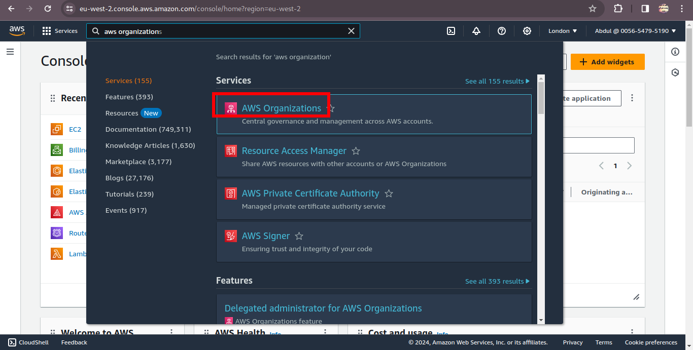

### AWS-CLOUD-SOLUTION-FOR-2-COMPANY-WEBSITES-USING-A-REVERSE-PROXY-TECHNOLOGY
General Overview
You will build a secure infrastructure inside AWS VPC (Virtual Private Cloud) for a fictitious company named WakaBetter that uses WordPress CMS for its main business website, and a Tooling Website for their DevOps team. As part of the company’s desire for improved security and performance, a decision has been made to use a reverse proxy technology from NGINX to achieve this. Cost, Security, and Scalability are the major requirements for this project. Hence, implementing the architecture designed below, ensure that infrastructure for both websites, WordPress and Tooling, is resilient to Web Server’s failures, can accomodate to increased traffic and, at the same time, has reasonable cost. 

### Requirements
There are few requirements that must be met before you begin:

1. Properly configure your AWS account and Organization Unit Watch How To Do This Here
    * Create an AWS Master account. (Also known as Root Account)
    * Within the Root account, create a sub-account and name it DevOps. (You will need another email address to complete this) 

    

    

    

    

    * Within the Root account, create an AWS Organization Unit (OU). Name it Dev. (We will launch Dev resources in there).

    

    

    * Move the DevOps account into the Dev OU. 
    

    

    

    * Login to the newly created AWS account using the new email address.

    

2. Create a domain name for your company. I used [namecheap](https://www.namecheap.com/).
3. Create a hosted zone in AWS, and map it to your domain. 

 

 

 

 

 

 ### SET UP A VIRTUAL PRIVATE CLOUD (VPC)
 --------
1. Create a VPC

 

 

2. Enable DNS hosting

 